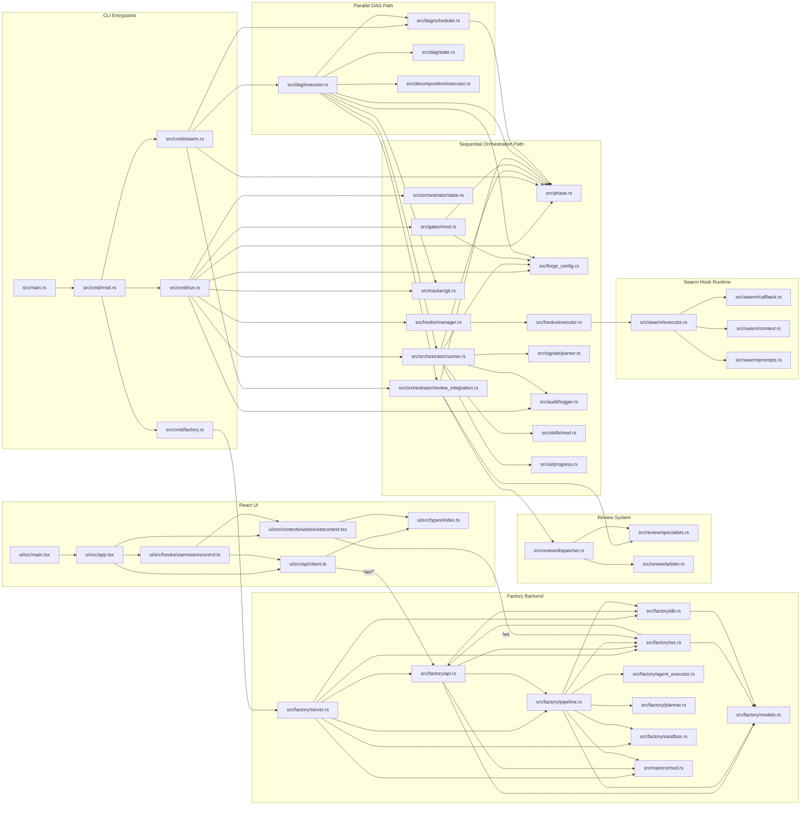

# Forge File-to-File Dependency Graph (Runtime Focus)

This is a higher-granularity graph than `docs/context-graph.md`, showing key runtime file-to-file links (imports/usages) across CLI, orchestrator, DAG, review, swarm, factory backend, and React UI.

Scope notes:

- Focused on execution-critical files.
- Omits tests and many leaf utility files to keep the graph readable.

## Mermaid Graph



## qmd Walkthrough (same index)

```bash
export XDG_CONFIG_HOME=/tmp/qmdcfg
export XDG_CACHE_HOME=/tmp/qmdcache
export TMPDIR=/tmp

bunx @tobilu/qmd --index forge-context get qmd://forge-rust/src/cmd/run.rs:1 -l 220
bunx @tobilu/qmd --index forge-context get qmd://forge-rust/src/dag/executor.rs:1 -l 260
bunx @tobilu/qmd --index forge-context get qmd://forge-rust/src/factory/pipeline.rs:1 -l 260
bunx @tobilu/qmd --index forge-context get qmd://forge-ui/ui/src/hooks/usemissioncontrol.ts:1 -l 220
```
