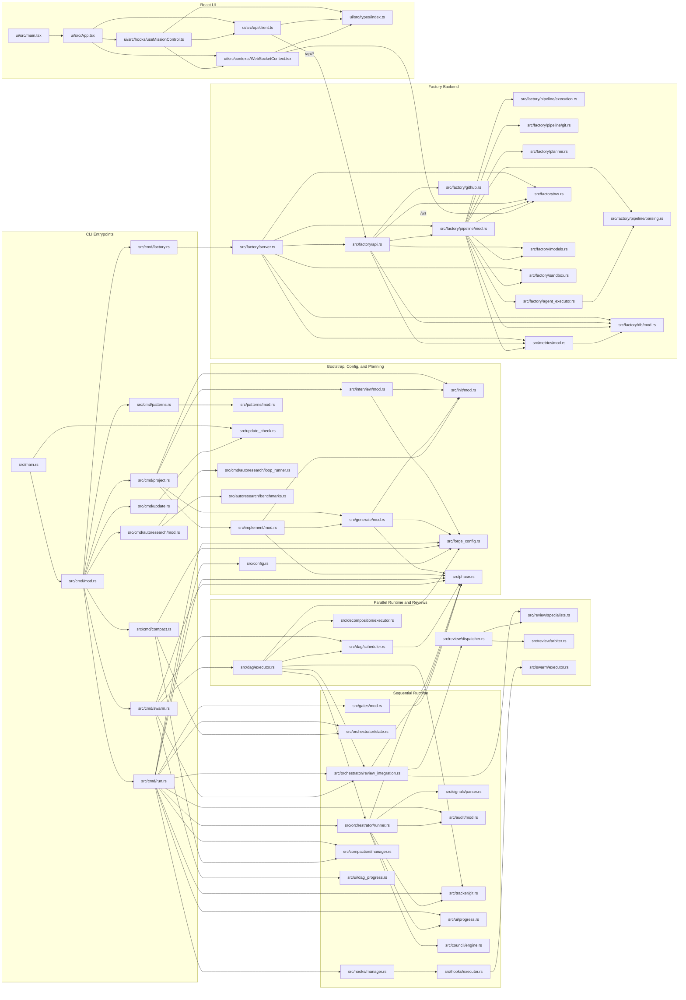

# Forge File-to-File Dependency Graph (Runtime Focus)

This is the higher-granularity companion to `docs/context-graph.md`, showing
the current execution-critical file links across CLI entrypoints, project
bootstrap, orchestration, DAG execution, reviews, factory backend, and the
React Mission Control UI.

Scope notes:

- Focused on control-flow-heavy files and current runtime boundaries.
- Uses current paths such as `src/factory/pipeline/mod.rs`,
  `src/factory/db/mod.rs`, `ui/src/App.tsx`, and
  `ui/src/contexts/WebSocketContext.tsx`.
- Omits tests and many leaf helpers to keep the graph readable.

## Mermaid Graph



## qmd Walkthrough

```bash
export XDG_CONFIG_HOME=/tmp/qmdcfg
export XDG_CACHE_HOME=/tmp/qmdcache
export TMPDIR=/tmp

bunx @tobilu/qmd --index forge-context get qmd://forge-rust/src/cmd/run.rs:1 -l 220
bunx @tobilu/qmd --index forge-context get qmd://forge-rust/src/dag/executor.rs:1 -l 260
bunx @tobilu/qmd --index forge-context get qmd://forge-rust/src/factory/pipeline/mod.rs:1 -l 320
bunx @tobilu/qmd --index forge-context get qmd://forge-rust/src/factory/server.rs:1 -l 240
bunx @tobilu/qmd --index forge-context get qmd://forge-ui/ui/src/App.tsx:1 -l 220
bunx @tobilu/qmd --index forge-context get qmd://forge-ui/ui/src/hooks/useMissionControl.ts:1 -l 260
```
