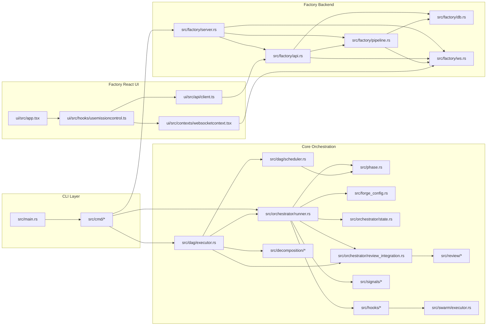

# Forge Context Graph (qmd-backed)

This graph was derived by indexing the repository with `qmd` and tracing subsystem links from:

- `src/main.rs`, `src/cmd/*`
- `src/orchestrator/*`, `src/dag/*`, `src/review/*`, `src/hooks/*`, `src/swarm/*`
- `src/factory/*`
- `ui/src/app.tsx`, `ui/src/hooks/usemissioncontrol.ts`, `ui/src/api/client.ts`, `ui/src/contexts/websocketcontext.tsx`

## Mermaid Graph



## Rebuild With qmd

```bash
# Isolated qmd config/cache in /tmp
export XDG_CONFIG_HOME=/tmp/qmdcfg
export XDG_CACHE_HOME=/tmp/qmdcache
export TMPDIR=/tmp

# Build/update a dedicated index for this repo
bunx @tobilu/qmd --index forge-context collection add . --name forge-rust --mask 'src/**/*.rs'
bunx @tobilu/qmd --index forge-context collection add . --name forge-docs --mask '**/*.md'
bunx @tobilu/qmd --index forge-context collection add . --name forge-ui --mask 'ui/src/**/*.{ts,tsx,js,jsx,css}'
bunx @tobilu/qmd --index forge-context update

# Explore files and relations
bunx @tobilu/qmd --index forge-context ls forge-rust
bunx @tobilu/qmd --index forge-context get qmd://forge-rust/src/orchestrator/mod.rs
bunx @tobilu/qmd --index forge-context get qmd://forge-rust/src/factory/mod.rs
```
