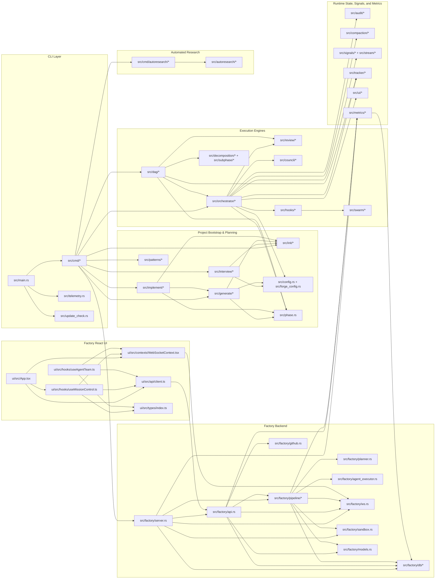

# Forge Context Graph (qmd-backed)

This graph reflects the current repository layout. It was refreshed by indexing
the repo with `qmd` and tracing subsystem links from:

- `src/main.rs`, `src/lib.rs`, `src/cmd/*`
- `src/init/*`, `src/interview/*`, `src/generate/*`, `src/implement/*`
- `src/orchestrator/*`, `src/dag/*`, `src/decomposition/*`, `src/review/*`,
  `src/council/*`, `src/hooks/*`, `src/swarm/*`
- `src/audit/*`, `src/compaction/*`, `src/metrics/*`, `src/tracker/*`,
  `src/ui/*`, `src/update_check.rs`
- `src/factory/*`
- `ui/src/App.tsx`, `ui/src/hooks/useMissionControl.ts`,
  `ui/src/hooks/useAgentTeam.ts`, `ui/src/api/client.ts`,
  `ui/src/contexts/WebSocketContext.tsx`

## Mermaid Graph



## Notable Shifts

- Factory runtime is now split across `src/factory/pipeline/*` and
  `src/factory/db/*`, rather than single `pipeline.rs` / `db.rs` files.
- Sequential orchestration now has first-class council, compaction, audit, and
  signal-tracking paths.
- The UI entrypoints are the current case-sensitive files:
  `ui/src/App.tsx` and `ui/src/contexts/WebSocketContext.tsx`.

## Rebuild With qmd

```bash
# Isolated qmd config/cache in /tmp
export XDG_CONFIG_HOME=/tmp/qmdcfg
export XDG_CACHE_HOME=/tmp/qmdcache
export TMPDIR=/tmp

# Build/update a dedicated index for this repo
bunx @tobilu/qmd --index forge-context collection add . --name forge-rust --mask 'src/**/*.rs'
bunx @tobilu/qmd --index forge-context collection add . --name forge-docs --mask '**/*.md'
bunx @tobilu/qmd --index forge-context collection add . --name forge-ui --mask 'ui/src/**/*.{ts,tsx,js,jsx,css}'
bunx @tobilu/qmd --index forge-context update

# Explore files and relations
bunx @tobilu/qmd --index forge-context ls forge-rust
bunx @tobilu/qmd --index forge-context get qmd://forge-rust/src/cmd/mod.rs:1 -l 220
bunx @tobilu/qmd --index forge-context get qmd://forge-rust/src/orchestrator/runner.rs:1 -l 260
bunx @tobilu/qmd --index forge-context get qmd://forge-rust/src/factory/pipeline/mod.rs:1 -l 260
bunx @tobilu/qmd --index forge-context get qmd://forge-rust/src/council/engine.rs:1 -l 240
bunx @tobilu/qmd --index forge-context get qmd://forge-ui/ui/src/App.tsx:1 -l 220
```
