# Issue Execution Flow — UI to PR

This diagram traces what happens when a user clicks "Run" on an issue in the Factory UI.

## Mermaid Flowchart

```mermaid
flowchart TD
    %% ── UI Layer ──────────────────────────────────────
    subgraph UI["React UI"]
        CLICK["User clicks Run on idle issue"]
        APICALL["POST /api/issues/:id/run<br/>(api/client.ts → triggerPipeline)"]
        WSRECV["WebSocket listener<br/>(useMissionControl)"]
    end

    %% ── API Layer ─────────────────────────────────────
    subgraph API["Factory API (api.rs)"]
        HANDLER["trigger_pipeline() handler"]
        DBCREATE["db.create_pipeline_run()<br/>status = Queued"]
        SPAWN["tokio::spawn background task"]
        RESPOND["Return 201 Created"]
    end

    %% ── Pipeline Orchestration ────────────────────────
    subgraph PIPE["Pipeline Runner (pipeline/mod.rs)"]
        RUNNING["Set status → Running<br/>Move issue → in_progress"]
        WS_START["broadcast PipelineStarted"]

        subgraph GIT_BRANCH["Git Branch Creation (git.rs)"]
            SLUG["Slugify title → forge/issue-N-slug"]
            CHECKOUT["git checkout -b branch"]
            DB_BRANCH["db.update_pipeline_branch()"]
            WS_BRANCH["broadcast PipelineBranchCreated"]
        end

        PLAN_DECIDE{Planner analysis}
    end

    %% ── Agent Team Path ───────────────────────────────
    subgraph TEAM["Agent Team Execution (pipeline/mod.rs + agent_executor.rs)"]
        PLAN["Planner::plan()<br/>Analyze issue → task graph"]
        DB_TEAM["db.create_agent_team()<br/>db.create_agent_task() × N"]
        WS_TEAM["broadcast TeamCreated"]

        subgraph WAVES["Wave Execution Loop"]
            direction TB
            WAVE_START["broadcast WaveStarted"]
            subgraph PARALLEL["Parallel Tasks in Wave"]
                WORKTREE["Set up git worktree<br/>(per-task isolation)"]
                CLAUDE_CALL["claude --print<br/>--output-format stream-json"]
                STREAM["Stream stdout line-by-line"]
                PARSE["OutputParser → events:<br/>AgentThinking, AgentAction,<br/>AgentOutput, AgentSignal,<br/>PipelineFileChanged"]
                WS_STREAM["broadcast events → UI"]
                MERGE_WT["Merge worktree → main branch"]
                TASK_DONE["broadcast AgentTaskCompleted"]
            end
            WAVE_END["broadcast WaveCompleted"]
        end
    end

    %% ── Forge Fallback Path ───────────────────────────
    subgraph FALLBACK["Forge Pipeline Fallback (execution.rs)"]
        FB_CHECK{".forge/phases.json<br/>exists?"}
        FB_SWARM["forge swarm<br/>--max-parallel 4 --fail-fast"]
        FB_CLAUDE["claude --print --verbose<br/>--output-format stream-json"]
        FB_STREAM["Stream process output<br/>→ PipelineOutputEvent"]
    end

    %% ── Post-Success ──────────────────────────────────
    subgraph POST["Post-Success (git.rs + mod.rs)"]
        GIT_PUSH["git push -u origin branch"]
        GH_PR["gh pr create<br/>--title --body"]
        DB_PR["db.update_pipeline_pr_url()"]
        WS_PR["broadcast PipelinePrCreated"]
        MOVE_REVIEW["db.move_issue → InReview"]
        WS_MOVE["broadcast IssueMoved"]
        COMPLETE["db.update_pipeline_run → Completed"]
        WS_DONE["broadcast PipelineCompleted"]
        METRICS["Record metrics"]
    end

    %% ── Error Path ────────────────────────────────────
    subgraph ERR["Error Handling"]
        FAIL["db.update_pipeline_run → Failed"]
        WS_FAIL["broadcast PipelineFailed"]
        ERR_METRICS["Record failure metrics"]
    end

    %% ── Connections ───────────────────────────────────

    CLICK --> APICALL
    APICALL --> HANDLER
    HANDLER --> DBCREATE --> SPAWN --> RESPOND
    RESPOND -.->|HTTP 201| WSRECV

    SPAWN --> RUNNING --> WS_START
    WS_START -.->|WS| WSRECV
    WS_START --> SLUG --> CHECKOUT --> DB_BRANCH --> WS_BRANCH
    WS_BRANCH -.->|WS| WSRECV
    WS_BRANCH --> PLAN_DECIDE

    %% Agent Team path
    PLAN_DECIDE -->|"multi-task plan"| PLAN
    PLAN --> DB_TEAM --> WS_TEAM
    WS_TEAM -.->|WS| WSRECV
    WS_TEAM --> WAVE_START --> WORKTREE --> CLAUDE_CALL --> STREAM --> PARSE --> WS_STREAM
    WS_STREAM -.->|WS| WSRECV
    WS_STREAM --> MERGE_WT --> TASK_DONE --> WAVE_END

    WAVE_END -->|"more waves"| WAVE_START
    WAVE_END -->|"all waves done"| GIT_PUSH

    %% Fallback path
    PLAN_DECIDE -->|"single task /<br/>planning failed"| FB_CHECK
    FB_CHECK -->|yes| FB_SWARM --> FB_STREAM
    FB_CHECK -->|no| FB_CLAUDE --> FB_STREAM
    FB_STREAM -.->|WS| WSRECV
    FB_STREAM --> GIT_PUSH

    %% Post-success
    GIT_PUSH --> GH_PR --> DB_PR --> WS_PR
    WS_PR -.->|WS| WSRECV
    WS_PR --> MOVE_REVIEW --> WS_MOVE
    WS_MOVE -.->|WS| WSRECV
    WS_MOVE --> COMPLETE --> WS_DONE --> METRICS
    WS_DONE -.->|WS| WSRECV

    %% Error path (from any step)
    PLAN_DECIDE -.->|"error at any step"| FAIL
    WAVE_END -.->|"task failure"| FAIL
    FB_STREAM -.->|"process error"| FAIL
    GH_PR -.->|"push/PR error"| FAIL
    FAIL --> WS_FAIL --> ERR_METRICS
    WS_FAIL -.->|WS| WSRECV

    %% ── Styles ────────────────────────────────────────
    classDef ui fill:#4a90d9,stroke:#2c5f8a,color:#fff
    classDef api fill:#6b8e23,stroke:#4a6319,color:#fff
    classDef pipe fill:#daa520,stroke:#b8860b,color:#000
    classDef team fill:#9370db,stroke:#6a4db5,color:#fff
    classDef fallback fill:#cd853f,stroke:#a0693a,color:#fff
    classDef post fill:#2e8b57,stroke:#1d5c39,color:#fff
    classDef err fill:#dc143c,stroke:#a0102d,color:#fff
    classDef ws fill:#87ceeb,stroke:#5ba0c0,color:#000

    class CLICK,APICALL ui
    class HANDLER,DBCREATE,SPAWN,RESPOND api
    class RUNNING,WS_START,SLUG,CHECKOUT,DB_BRANCH,WS_BRANCH,PLAN_DECIDE pipe
    class PLAN,DB_TEAM,WS_TEAM,WAVE_START,WORKTREE,CLAUDE_CALL,STREAM,PARSE,WS_STREAM,MERGE_WT,TASK_DONE,WAVE_END team
    class FB_CHECK,FB_SWARM,FB_CLAUDE,FB_STREAM fallback
    class GIT_PUSH,GH_PR,DB_PR,WS_PR,MOVE_REVIEW,WS_MOVE,COMPLETE,WS_DONE,METRICS post
    class FAIL,WS_FAIL,ERR_METRICS err
    class WSRECV ws
```

## Key File References

| Step | File | Function |
|------|------|----------|
| Run button click | `ui/src/App.tsx:296-318` | Click handler |
| API call | `ui/src/api/client.ts:61-62` | `triggerPipeline()` |
| WebSocket handler | `ui/src/hooks/useMissionControl.ts:250-537` | Message processing |
| HTTP handler | `src/factory/api.rs:989-1032` | `trigger_pipeline()` |
| Pipeline orchestration | `src/factory/pipeline/mod.rs:582-960` | `start_run()` |
| Agent team execution | `src/factory/pipeline/mod.rs:203-400` | `execute_agent_team()` |
| Agent task runner | `src/factory/agent_executor.rs:54-500+` | `AgentExecutor::run_task()` |
| Forge fallback | `src/factory/pipeline/execution.rs:134-280+` | `execute_pipeline_streaming()` |
| Git branch/PR | `src/factory/pipeline/git.rs:69-169` | `create_git_branch()`, `create_pull_request()` |
| DB: pipeline | `src/factory/db/pipeline.rs` | CRUD for runs, branches, PRs |
| DB: agents | `src/factory/db/agents.rs` | Team/task records |
| DB: issues | `src/factory/db/issues.rs` | `move_issue()` |
| WebSocket broadcast | `src/factory/ws.rs:28-210` | `broadcast_message()` |

## Execution Paths

1. **Happy path**: Issue → Planner → Agent Team (parallel waves) → PR Created → Issue moved to InReview
2. **Fallback path**: Issue → Planner fails / single task → Forge swarm or direct Claude → PR Created
3. **Error path**: Any step fails → status=Failed, issue stays at current column, no PR
